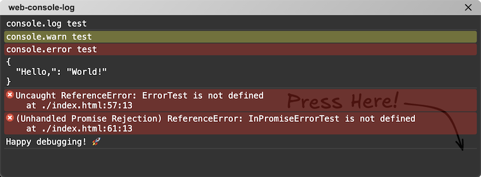

# Web Console Log

A lightweight utility that provides a **console.log** and **Error log screen** directly on the web. This tool is designed for developers who cannot access or use browser DevTools due to restrictions in their environments, such as web editors like CodeSandbox or embedded browser environments.

## Features

- **Console log display**: View `console.log` outputs in a convenient web-based log screen.
- **Error log capture**: Automatically capture and display runtime JavaScript errors.
- **Easy integration**: Add a single script to your project to enable the functionality.



## Live Demo

https://tkihira.github.io/web-console-log/sample.html

## Why Use Web Console Log?

- **DevTools unavailable?** Use `web-console-log` to debug directly in environments like:
  - Online code editors (e.g., CodeSandbox, JSFiddle, Monaca)
  - Embedded browsers in applications
  - Devices with limited DevTools access
- **Simple to use**: Just include the script tag, and you're ready to debug.

## Suitable Use Cases

- Developing in browser-based environments
  - Ideal for writing code in environments like CodeSandbox, JSFiddle, or Monaca.
- For users unfamiliar with DevTools
  - A convenient way to capture and send error logs for testers or QA personnel, helping them share error details when issues occur.
- Educational purposes
  - Perfect for programming learners to easily view console outputs.
  - Can be embedded in educational web materials to make errors and outputs more comprehensible for beginners.
- Remote debugging
  - Useful for sharing debugging information with non-developers, such as clients or field testers.
  - Facilitates problem identification and reporting in remote scenarios.
  - IoT or WebView debugging
- Designed for debugging embedded browser environments like mobile app WebViews or smart devices.
  - Works in environments where traditional DevTools are unavailable.

## Notes

- The debugger icon will not appear until an error occurs or a `console.log` statement is invoked.
- This script only displays errors and `console.log` messages that occur in the directory of the HTML file where it is loaded. Errors and `console.log` messages from other directories will not be displayed.
- This program is intended for lightweight debugging purposes. It is strongly discouraged to use this in production environments.

## Installation

### Via CDN

Add the following script to your HTML file:

```html
<script src="https://cdn.jsdelivr.net/npm/web-console-log"></script>
```

Alternatively, you can specify the version numbers.

```html
<script src="https://cdn.jsdelivr.net/npm/web-console-log@0.0.1"></script>
```

Once initialized, all console.log outputs and Error events will be displayed on the web log screen.

### Via npm

I don't recommend installing this package through npm because it usually doesn't serve a purpose. However, if you dare to try,

```bash
npm install web-console-log
```

## Usage

## Example

```html
<!DOCTYPE html>
<html>

<head>
    <title>Web Console Log Example</title>
    <script src="https://cdn.jsdelivr.net/npm/web-console-log"></script>
</head>

<body>
    <script>
        setTimeout(() => {
            console.log("console.log test");
            console.warn("console.warn test");
            console.error("console.error test");
            console.log("==================\n\n\n");
        }, 2000);
        setTimeout(() => {
            ErrorTest;
        }, 4000);
        (async () => {
            await new Promise(r => setTimeout(r, 6000));
            InPromiseErrorTest;
        })();
        (async () => {
            await new Promise(r => setTimeout(r, 8000));
            const callStackExceededTest = () => callStackExceededTest();
            callStackExceededTest();
        })();
    </script>
</body>

</html>
```

## Contributing

Contributions are welcome! If you encounter a bug or have a feature request, feel free to open an issue or submit a pull request.

1. Fork the repository.
2. Create a new branch for your feature or bugfix.
3. Commit your changes and push your branch.
4. Submit a pull request.

## License

This project is licensed under the MIT License.

Happy debugging! 🚀
